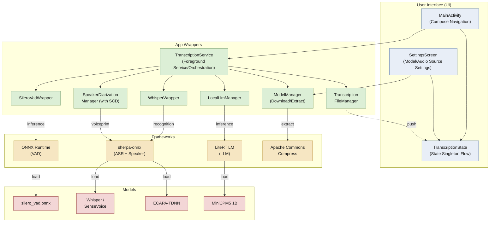

[](https://deepwiki.com/zeerd/Real-timeTranscription)

# Real-time Transcription App

An Android real-time speech transcription app that runs entirely on-device (offline).

---

## 1. Introduction

This app captures speech in real time through the microphone and completes the full pipeline of **Voice Activity Detection (VAD) → Automatic Speech Recognition (ASR) → Speaker Diarization → Semantic Segmentation & Polishing (LLM)** locally on the phone. The transcription results are displayed on the screen in real time and automatically saved to files.

Core features:

- **Fully offline / on-device inference**: All models (VAD, ASR, speaker diarization, LLM) run on the device. No network connection is required for transcription, protecting your privacy.
- **Multilingual recognition**: Based on the Whisper / SenseVoice model families, supporting Chinese, English, Japanese, Korean, and more.
- **Speaker Diarization**: Distinguishes different speakers via voiceprints (ECAPA-TDNN), labeling "who said what and when".
- **Voiceprint sliding-window Speaker Change Detection (SCD)**: Even when two people take turns seamlessly without a pause in between, it can force a segment break, avoiding merging them into one segment.
- **Local LLM semantic polishing**: Built on the LiteRT framework, it performs semantic segmentation, punctuation, and paragraph organization (formal draft) on fragmented sentences by speaker / pause boundaries.
- **Multiple selectable models**: Tiny / Base / Small / SenseVoice and other accuracy-and-size tiers to fit devices of different performance levels.
- **In-app model download / manual import**: Large models such as Whisper are not bundled with the APK; they can be downloaded from the settings page or manually copied into private storage.
- **Real-time saving (two copies)**: Transcription text is automatically saved to the app's private files, and the user can also specify a save directory via the system directory picker. The raw ASR results and the LLM-polished formal draft are **saved as two separate files** that do not overwrite each other.
- **LLM polishing can be toggled**: The local LLM semantic polishing can be turned off in the settings page. When off, only the real-time raw transcription is kept (the LLM engine is not loaded and no segmentation/polishing is performed).

---

## 2. Architecture

### 2.1 Tech Stack

- **Language**: Kotlin 2.2
- **UI**: Jetpack Compose (Material 3) + Navigation Compose (single Activity: `MainActivity`)
- **Concurrency model**: Kotlin Coroutines + Channels, connecting each processing stage via a "producer-consumer" pipeline
- **Inference engines**: ONNX Runtime (VAD), sherpa-onnx (ASR), Google AI Edge LiteRT (LLM)
- **Minimum / Target SDK**: minSdk 26 (Android 8.0) / targetSdk 35
- **Parameters**: Audio is captured as 16kHz mono PCM, with one frame being 512 samples (32ms)

### 2.2 Architecture




### 2.3 Key Modules

Taking the green "App Wrappers" box in 2.2 as a unit, the table below lists the implementation files and responsibilities of each module:

| Module (green box in 2.2) | Implementation File | Responsibility |
| :--- | :--- | :--- |
| `TranscriptionService` (Foreground Service / Orchestration) | `TranscriptionService.kt`,<br/>`TranscriptionPipeline.kt`,<br/> `SemanticBuffer.kt` | **The "conductor" of the entire pipeline**. It is a long-running background foreground service: even if you switch to another app or lock the screen, recording and transcription will not stop. It is responsible for opening the microphone, chaining the following modules to run in order, and deciding "where a sentence ends and whether to switch to the next segment", and finally pushing the real-time text to the screen. |
| `SileroVadWrapper` | `SileroVadWrapper.kt` | **The "is anyone speaking right now?" detector (Voice Activity Detection / VAD)**. It listens to the audio frame by frame, answering only one question: is there actually someone speaking in this 32-millisecond window? This way it can discard silent segments and only pass the parts with real speech to the recognition module, saving power and compute. |
| `WhisperWrapper` | `WhisperWrapper.kt` | **The "transcribe sound into text" stenographer (Automatic Speech Recognition / ASR)**. It receives the speech segments filtered above and outputs text. It supports multiple languages including Chinese, English, Japanese, and Korean; which model to use (Whisper or SenseVoice) is automatically determined by the model files actually present in the folder. |
| `SpeakerDiarizationManager` (with SCD) | `SpeakerDiarizationManager.kt`,<br/>`SpeakerChangeDetector.kt` | **The "who said this?" identifier (Speaker Diarization)**. It extracts a "voiceprint fingerprint" for each person's voice and remembers it, thereby labeling the transcription results as "Speaker 1 / Speaker 2...". The SCD (Speaker Change Detection) within it specifically handles the case where two people take turns seamlessly without a pause, forcing the preceding and following sentences to be assigned to different speakers to avoid being mistakenly merged into one segment. |
| `LocalLlmManager` | `LocalLlmManager.kt` | **The "polishing editor"**. The raw recognized text often lacks punctuation and has broken sentences. It uses an on-device small model (MiniCPM5 1B) to organize the fragmented sentences into a readable draft with punctuation and clear segmentation. This step can be toggled; when turned off, only the raw transcription is kept and the model is not loaded. |
| `ModelManager` (Download / Extract) | `ModelManager.kt` | **The "model repository manager"**. AI models are too large (tens of MB to over a GB) to be bundled into the installer. It is responsible for downloading the models on the settings page, extracting them to the right place, and recording which models are installed and available. |
| `TranscriptionFileManager` | `TranscriptionFileManager.kt` | **The "auto-archiver"**. It writes the text into files in real time during transcription, so nothing is lost even if the app is closed; the raw draft and the polished formal draft are stored as two separate files that do not overwrite each other, making it easy to compare later. |

> The user interface (blue box in 2.2) consists of `MainActivity.kt` (Compose Navigation), `SettingsScreen.kt` (model / audio source settings), and `TranscriptionState.kt` (a cross-component shared state singleton Flow); `TranscriptionApplication.kt` holds the `ModelManager` and `TranscriptionFileManager` singletons and creates the notification channel.

### 2.4 Design Highlights

- **Content-driven rather than string-driven**: `WhisperWrapper` determines the model type by the actual files in the directory (whether `encoder/decoder` onnx exist), so adding a new model requires no code changes.
- **Unbounded channels to prevent segment loss**: `audioChannel` / `transcriptionChannel` / `processingChannel` all use `Channel.UNLIMITED`, avoiding overwriting and dropping audio segments during slow processing (voiceprint extraction, LLM inference).
- **SCD throttling**: Voiceprint embedding extraction is expensive (hundreds of ms), so it is triggered on a 200ms sliding step to avoid slowing down real-time performance.
- **GPU→CPU fallback**: The LLM engine attempts GPU for the first two tries, falls back to CPU on failure, and the processing loop is started only once to avoid contention.
- **Continuous background recording & transcription**: The entire pipeline runs in the `TranscriptionService` foreground service (declaring `FOREGROUND_SERVICE_TYPE_MICROPHONE`); recording and transcription do not stop after the Activity is destroyed / the app goes to the background; the UI and the service are decoupled via the `TranscriptionState` singleton, and the service provides a "Stop" entry in the notification bar.

---

## 3. Dependencies & Resources

### 3.1 Core Technical Dependencies

| Core Capability | Dependency | Version |
| :--- | :--- | :--- |
| VAD | ONNX Runtime Android (+ Extensions) | 1.27.0 / 0.13.0 |
| ASR | sherpa-onnx (k2-fsa) | v1.13.4 |
| Speaker Diarization | sherpa-onnx Speaker Embedding Extractor + ECAPA-TDNN voiceprint model | v1.13.4 |
| Local LLM Polishing | Google AI Edge LiteRT / LiteRT LM (with GPU backend) | 1.4.2 / 0.14.0 |

### 3.2 Downloaded Model Resources

The following resources are **not bundled with the APK**; they are obtained via build tasks or in-app downloads (the name is the download link):

| Resource | Type | Size | Purpose |
| :--- | :--- | :--- | :--- |
| [`silero_vad.onnx`](https://github.com/k2-fsa/sherpa-onnx/releases/download/asr-models/silero_vad.onnx) | ONNX | ~600KB | VAD (auto-downloaded to `assets/` at build time by `preBuild`) |
| [`sherpa-onnx-whisper-tiny.tar.bz2`](https://github.com/k2-fsa/sherpa-onnx/releases/download/asr-models/sherpa-onnx-whisper-tiny.tar.bz2) | TAR.BZ2 | ~150MB | Whisper Tiny ASR (multilingual) |
| [`sherpa-onnx-whisper-base.tar.bz2`](https://github.com/k2-fsa/sherpa-onnx/releases/download/asr-models/sherpa-onnx-whisper-base.tar.bz2) | TAR.BZ2 | ~290MB | Whisper Base ASR (multilingual) |
| [`sherpa-onnx-whisper-small.tar.bz2`](https://github.com/k2-fsa/sherpa-onnx/releases/download/asr-models/sherpa-onnx-whisper-small.tar.bz2) | TAR.BZ2 | ~960MB | Whisper Small ASR (multilingual) |
| [`sherpa-onnx-sense-voice-zh-en-ja-ko-yue-int8-2024-07-17.tar.bz2`](https://github.com/k2-fsa/sherpa-onnx/releases/download/asr-models/sherpa-onnx-sense-voice-zh-en-ja-ko-yue-int8-2024-07-17.tar.bz2) | TAR.BZ2 | ~240MB | SenseVoice Small ASR (multilingual) (**recommended**) |
| [`3dspeaker_speech_campplus_sv_zh-cn_16k-common.onnx`](https://github.com/k2-fsa/sherpa-onnx/releases/download/speaker-recongition-models/3dspeaker_speech_campplus_sv_zh-cn_16k-common.onnx) | ONNX | ~20MB | ECAPA-TDNN Speaker Diarization |
| [`3dspeaker_speech_eres2netv2_sv_zh-cn_16k-common.onnx `](https://github.com/k2-fsa/sherpa-onnx/releases/tag/speaker-recongition-models/3dspeaker_speech_eres2netv2_sv_zh-cn_16k-common.onnx ) | ONNX | ~70MB | ECAPA-TDNN Speaker Diarization (**recommended**) |
| [`minicpm_dynamic_wi8_afp32_gpu_opt.litertlm`](https://huggingface.co/litert-community/MiniCPM5-1B/resolve/main/minicpm_dynamic_wi8_afp32_gpu_opt.litertlm?download=true) ([`modelscope`](https://www.modelscope.cn/models/litert-community/MiniCPM5-1B/files)) | TFLite | ~1.0GB | MiniCPM5 1B local LLM polishing |

> After extraction, Whisper / SenseVoice must contain `[prefix]-encoder.int8.onnx`, `[prefix]-decoder.int8.onnx`, `[prefix]-tokens.txt` (SenseVoice is a single onnx). Models are stored at `/data/user/0/com.zeerd.real_timetranscriptionapp/files/models/[model-id]/`.

---

## 4. Third-Party Licensing

> This repository's root directory does not contain a standalone `LICENSE` file; the following are the upstream licenses of each dependency and model. For specific terms, please refer to each official repository / release page.

### 4.1 Code Dependencies (Libraries)

| Dependency | License |
| :--- | :--- |
| Apache Commons Compress | Apache License 2.0 |
| ONNX Runtime Android / Extensions | MIT License |
| sherpa-onnx (k2-fsa) | Apache License 2.0 |
| Google AI Edge LiteRT / LiteRT LM | Apache License 2.0 |

### 4.2 Model Weights

| Model | License |
| :--- | :--- |
| Silero VAD (`silero_vad.onnx`) | MIT License |
| Whisper family (Tiny/Base/Small, OpenAI, exported via k2-fsa) | MIT License |
| SenseVoice Small (Alibaba FunASR) | Apache License 2.0 |
| ECAPA-TDNN speaker model (3D-Speaker / CAM++) | See k2-fsa release page (Apache 2.0-like open-source license) |
| MiniCPM5 1B | Apache License 2.0  |

### 4.3 Compliance Notes

- Using the Gemma 2B model requires agreeing to the [Gemma Terms of Use](https://ai.google.dev/gemma/terms) and complying with its usage restrictions (e.g., a monthly active user threshold requires separate application).
- Redistribution and modification of each model weight and code dependency must retain the corresponding copyright and license notices.
- This app is for local offline inference only. Before deploying to a production environment, please verify the compliance requirements of each upstream license one by one.

---

## 5. Build & Run (Brief)

```bash
# After cloning, open this project with Android Studio, or from the command line:
./gradlew assembleDebug
```

- The build-time `preBuild` task automatically downloads `silero_vad.onnx` to `app/src/main/assets/` (requires network access).
- After the first run, download or manually import the Whisper / SenseVoice, speaker, and LLM models on the "Settings" page to use the corresponding features.
- The `RECORD_AUDIO` permission is required; on Android 12+, it will attempt to load the vendor-layer `libOpenCL.so` to enable GPU acceleration (automatically falls back to CPU if missing).

---

## 6. Saved Files (Two Copies on Disk)

The transcription results are **saved as two copies simultaneously**, corresponding to the "Live Stream (Raw)" and "Formal Draft (Formal)" tabs on the interface:

| Content | Internal Private File | File in User-Specified Directory |
| :--- | :--- | :--- |
| Raw ASR results (before polishing) | `files/autosave_transcription_raw.txt` | `<user directory>/transcription_raw.txt` |
| LLM-polished formal draft | `files/autosave_transcription_formal.txt` | `<user directory>/transcription_formal.txt` |

- **Default (no directory specified)**: Writes to the two files in the app's private storage; the history of both tabs is automatically restored after a restart.
- **Specified directory**: Click the save button at the bottom right, and select a folder via the system directory picker (`OpenDocumentTree`); the app persists the read/write permission for that directory and creates `transcription_raw.txt` and `transcription_formal.txt` in it, writing the raw draft and the formal draft respectively.
- The two files are independent of each other; the formal draft will not overwrite the raw draft, making it easy to compare and verify later.
