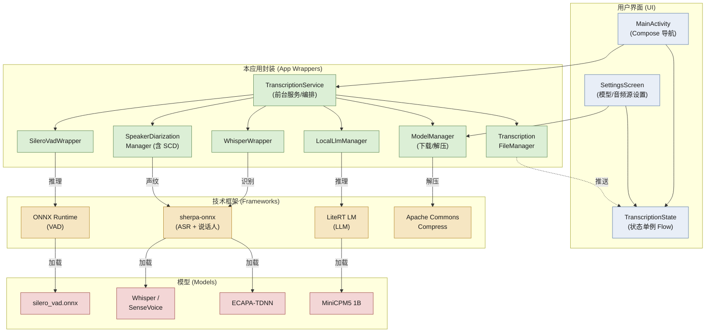

# Real-time Transcription App

一个完全在设备本地（离线）运行的 Android 实时语音转写应用。

---

## 1. 应用简介

本应用通过麦克风实时采集语音，在手机端本地完成 **语音活动检测（VAD）→ 语音识别（ASR）→ 说话人分离（Diarization）→ 语义分段与润色（LLM）** 的完整链路，并将转写结果实时显示在界面上、自动保存到文件。

核心特性：

- **完全离线 / 本地推理**：所有模型（VAD、ASR、说话人分离、LLM）均在设备端运行，无需联网即可转写，保护隐私。
- **多语种识别**：基于 Whisper / SenseVoice 系列模型，支持中、英、日、韩等多语种。
- **说话人分离（Diarization）**：通过声纹（ECAPA-TDNN）区分不同说话人，标注「谁在什么时候说了什么」。
- **声纹滑窗换人检测（SCD）**：即便两人无缝接话、中间没有停顿，也能强制切段，避免被并成一段。
- **本地 LLM 语义润色**：内置LiteRT框架，按说话人 / 停顿边界对零散句子做语义分段、加标点、整理成段落（正式稿）。
- **多模型可选**：Tiny / Base / Small / SenseVoice 等多档精度与体积，适配不同性能的设备。
- **模型应用内下载 / 手动导入**：Whisper 等大模型不随 APK 打包，可在设置页下载或手动拷贝到私有存储。
- **实时保存（双份）**：转写文本自动保存到应用私有文件，也可由用户通过系统目录选择器指定保存目录。原始 ASR 结果与 LLM 润色后的正式稿**分别保存为两份文件**，互不覆盖。
- **LLM 润色可开关**：在设置页可关闭本地 LLM 语义润色，关闭后仅保留实时原始转写（不加载 LLM 引擎、不做分段润色）。

---

## 2. 设计架构

### 2.1 技术栈

- **语言**：Kotlin 2.2
- **UI**：Jetpack Compose（Material 3）+ Navigation Compose（单 Activity：`MainActivity`）
- **并发模型**：Kotlin 协程（Coroutines）+ 通道（Channel），以「生产者-消费者」管线串联各处理阶段
- **推理引擎**：ONNX Runtime（VAD）、sherpa-onnx（ASR）、Google AI Edge LiteRT（LLM）
- **最低 / 目标 SDK**：minSdk 26（Android 8.0）/ targetSdk 35
- **参数**：音频以 16kHz 单声道 PCM 采集，按 512 样本（32ms）为一帧

### 2.2 架构




### 2.3 关键模块

以 2.2 中绿色「本应用封装」框为单元，下表列出各模块的实现文件与职责：

| 模块（2.2 绿色框） | 实现文件 | 职责 |
| :--- | :--- | :--- |
| `TranscriptionService`（前台服务 / 编排） | `TranscriptionService.kt`、<br/>`TranscriptionPipeline.kt`、<br/> `SemanticBuffer.kt` | **整条流水线的「总指挥」**。它是一个常驻后台的前台服务：即使你切到别的 App 或锁屏，录音和转写也不会停。它负责打开麦克风、把后面几个模块串起来按顺序跑，并判断「一句话说到哪算完、该不该切到下一段」，最后把实时文字推到屏幕上。 |
| `SileroVadWrapper` | `SileroVadWrapper.kt` | **「现在有人说话吗？」的判断器（语音活动检测 / VAD）**。它一帧一帧地听音频，只回答一个问题：当前这 32 毫秒里到底有没有人在讲话。这样就能把安静的片段丢掉，只把真正有语音的部分交给后面的识别模块，省电也省算力。 |
| `WhisperWrapper` | `WhisperWrapper.kt` | **「把声音变成文字」的听写员（语音识别 / ASR）**。它接收上面筛出来的语音片段，输出成文字。支持中文、英文、日文、韩文等多语种；具体用哪个模型（Whisper 还是 SenseVoice）由文件夹里实际存在的模型文件自动决定。 |
| `SpeakerDiarizationManager`（含 SCD） | `SpeakerDiarizationManager.kt`、<br/>`SpeakerChangeDetector.kt` | **「这句话是谁说的？」的辨认器（说话人分离 / Diarization）**。它给每个人的声音提取一个「声纹指纹」并记住，从而把转写结果标注成「说话人 1 / 说话人 2……」。其中的 SCD（换人检测）专门处理两人无缝接话、中间没有停顿的情况，强制把前后两句话分给不同人，避免被误并成一段。 |
| `LocalLlmManager` | `LocalLlmManager.kt` | **「润色编辑」**。原始识别出来的文字往往没有标点、句子乱断。它用设备端的小模型（MiniCPM5 1B）把零散句子整理成有标点、分段清晰的易读稿。这一步可开关；关掉后只保留原始转写、不加载该模型。 |
| `ModelManager`（下载 / 解压） | `ModelManager.kt` | **「模型仓库管理员」**。AI 模型体积太大（几十 MB 到上 GB），不能塞进安装包。它负责在设置页里把模型下载下来、解压到位，并记录哪些模型已经装好可用。 |
| `TranscriptionFileManager` | `TranscriptionFileManager.kt` | **「自动存档」**。转写过程中实时把文字写进文件，关掉 App 也不会丢；原始稿和润色后的正式稿分别存成两个文件，互不覆盖，方便事后对照。 |

> 用户界面（2.2 蓝色框）由 `MainActivity.kt`（Compose 导航）、`SettingsScreen.kt`（模型 / 音频源设置）、`TranscriptionState.kt`（跨组件共享的状态单例 Flow）组成；`TranscriptionApplication.kt` 持有 `ModelManager` 与 `TranscriptionFileManager` 单例并创建通知渠道。

### 2.4 设计要点

- **内容驱动而非字符串驱动**：`WhisperWrapper` 通过目录内实际文件（是否存在 `encoder/decoder` onnx）判断模型类型，新增模型无需改代码。
- **无界通道防丢段**：`audioChannel` / `transcriptionChannel` / `processingChannel` 均使用 `Channel.UNLIMITED`，避免慢速处理（声纹提取、LLM 推理）期间覆盖丢弃音频段。
- **SCD 节流**：声纹 embedding 提取开销大（数百 ms），按 200ms 滑动步长触发，避免拖慢实时性。
- **GPU→CPU 回退**：LLM 引擎前两次尝试 GPU，失败则回退 CPU，且处理循环仅启动一次避免竞争。
- **后台持续录音转写**：整条管线运行在 `TranscriptionService` 前台服务中（声明 `FOREGROUND_SERVICE_TYPE_MICROPHONE`），Activity 销毁 / 应用切后台后录音与转写不中断；UI 与服务通过 `TranscriptionState` 单例解耦，服务在通知栏提供「停止」入口。

---

## 3. 依赖资源

### 3.1 核心技术依赖

| 核心能力 | 依赖 | 版本 |
| :--- | :--- | :--- |
| VAD | ONNX Runtime Android（+ Extensions） | 1.27.0 / 0.13.0 |
| ASR | sherpa-onnx（k2-fsa） | v1.13.4 |
| 说话人分离 | sherpa-onnx Speaker Embedding Extractor + ECAPA-TDNN 声纹模型 | v1.13.4 |
| 本地 LLM 润色 | Google AI Edge LiteRT / LiteRT LM（含 GPU 后端） | 1.4.2 / 0.14.0 |

### 3.2 下载的模型资源

以下资源 **不随 APK 打包**，由构建任务或应用内下载获取（名称即下载链接）：

| 资源 | 类型 | 大小 | 用途 |
| :--- | :--- | :--- | :--- |
| [`silero_vad.onnx`](https://github.com/k2-fsa/sherpa-onnx/releases/download/asr-models/silero_vad.onnx) | ONNX | ~600KB | VAD（构建期 `preBuild` 自动下载到 `assets/`） |
| [`sherpa-onnx-whisper-tiny.tar.bz2`](https://github.com/k2-fsa/sherpa-onnx/releases/download/asr-models/sherpa-onnx-whisper-tiny.tar.bz2) | TAR.BZ2 | ~150MB | Whisper Tiny ASR（多语种） |
| [`sherpa-onnx-whisper-base.tar.bz2`](https://github.com/k2-fsa/sherpa-onnx/releases/download/asr-models/sherpa-onnx-whisper-base.tar.bz2) | TAR.BZ2 | ~290MB | Whisper Base ASR（多语种） |
| [`sherpa-onnx-whisper-small.tar.bz2`](https://github.com/k2-fsa/sherpa-onnx/releases/download/asr-models/sherpa-onnx-whisper-small.tar.bz2) | TAR.BZ2 | ~960MB | Whisper Small ASR（多语种） |
| [`sherpa-onnx-sense-voice-zh-en-ja-ko-yue-int8-2024-07-17.tar.bz2`](https://github.com/k2-fsa/sherpa-onnx/releases/download/asr-models/sherpa-onnx-sense-voice-zh-en-ja-ko-yue-int8-2024-07-17.tar.bz2) | TAR.BZ2 | ~240MB | SenseVoice Small ASR（多语种）（**推荐**） |
| [`3dspeaker_speech_campplus_sv_zh-cn_16k-common.onnx`](https://github.com/k2-fsa/sherpa-onnx/releases/download/speaker-recongition-models/3dspeaker_speech_campplus_sv_zh-cn_16k-common.onnx) | ONNX | ~20MB | ECAPA-TDNN 说话人分离 |
| [`3dspeaker_speech_eres2netv2_sv_zh-cn_16k-common.onnx `](https://github.com/k2-fsa/sherpa-onnx/releases/tag/speaker-recongition-models/3dspeaker_speech_eres2netv2_sv_zh-cn_16k-common.onnx ) | ONNX | ~70MB | ECAPA-TDNN 说话人分离 （**推荐**） |
| [`minicpm_dynamic_wi8_afp32_gpu_opt.litertlm`](https://huggingface.co/litert-community/MiniCPM5-1B/resolve/main/minicpm_dynamic_wi8_afp32_gpu_opt.litertlm?download=true)（[`modelscope`](https://www.modelscope.cn/models/litert-community/MiniCPM5-1B/files)） | TFLite | ~1.0GB | MiniCPM5 1B 本地 LLM 润色 |

> Whisper / SenseVoice 解压后需含 `[prefix]-encoder.int8.onnx`、`[prefix]-decoder.int8.onnx`、`[prefix]-tokens.txt`（SenseVoice 为单 onnx）。模型存放于 `/data/user/0/com.zeerd.real_timetranscriptionapp/files/models/[model-id]/`。

---

## 4. 第三方授权方式

> 本仓库根目录未包含独立的 `LICENSE` 文件；以下为各依赖与模型的上游授权方式，具体条款请以各自官方仓库 / 发布页为准。

### 4.1 代码依赖（库）

| 依赖 | 授权协议 |
| :--- | :--- |
| Apache Commons Compress | Apache License 2.0 |
| ONNX Runtime Android / Extensions | MIT License |
| sherpa-onnx (k2-fsa) | Apache License 2.0 |
| Google AI Edge LiteRT / LiteRT LM | Apache License 2.0 |

### 4.2 模型权重

| 模型 | 授权方式 |
| :--- | :--- |
| Silero VAD (`silero_vad.onnx`) | MIT License |
| Whisper 系列（Tiny/Base/Small，OpenAI，经 k2-fsa 导出） | MIT License |
| SenseVoice Small（阿里巴巴 FunASR） | Apache License 2.0 |
| ECAPA-TDNN 说话人模型（3D-Speaker / CAM++） | 见 k2-fsa 发布页（Apache 2.0 类开源协议） |
| MiniCPM5 1B | Apache License 2.0  |

### 4.3 合规提示

- 使用 Gemma 2B 模型须同意 [Gemma 使用条款](https://ai.google.dev/gemma/terms)，并遵守其使用限制（如月活用户阈值需另行申请）。
- 各模型权重与代码依赖的再分发、修改须保留相应版权与许可声明。
- 本应用仅用于本地离线推理，部署到生产环境前请逐一核对各上游许可的合规要求。

---

## 5. 构建与运行（简述）

```bash
# 克隆后，使用 Android Studio 打开本工程，或命令行：
./gradlew assembleDebug
```

- 构建期 `preBuild` 任务会自动下载 `silero_vad.onnx` 到 `app/src/main/assets/`（需联网）。
- 首次运行后，在「设置」页下载或手动导入 Whisper / SenseVoice、说话人、LLM 模型方可使用对应功能。
- 需要 `RECORD_AUDIO` 权限；Android 12+ 会尝试加载 vendor 层 `libOpenCL.so` 以启用 GPU 加速（缺失时自动回退 CPU）。

---

## 6. 保存文件说明（双份落盘）

转写结果会**同时保存两份**，分别对应界面上的「实时流 (Raw)」与「正式稿 (Formal)」两个标签页：

| 内容 | 内部私有文件 | 用户指定目录中的文件 |
| :--- | :--- | :--- |
| 原始 ASR 结果（润色前） | `files/autosave_transcription_raw.txt` | `<用户目录>/transcription_raw.txt` |
| LLM 润色后的正式稿 | `files/autosave_transcription_formal.txt` | `<用户目录>/transcription_formal.txt` |

- **默认（未指定目录）**：写入应用私有存储的两个文件，重启后自动恢复两个标签页的历史。
- **指定目录**：点击右下角保存按钮，通过系统目录选择器（`OpenDocumentTree`）选择一个文件夹；应用会持久化该目录的读写权限，并在其中创建 `transcription_raw.txt` 与 `transcription_formal.txt` 两个文件，分别写入原始稿与正式稿。
- 两份文件相互独立，正式稿不会覆盖原始稿，便于后续对照核对。
